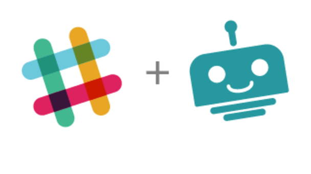
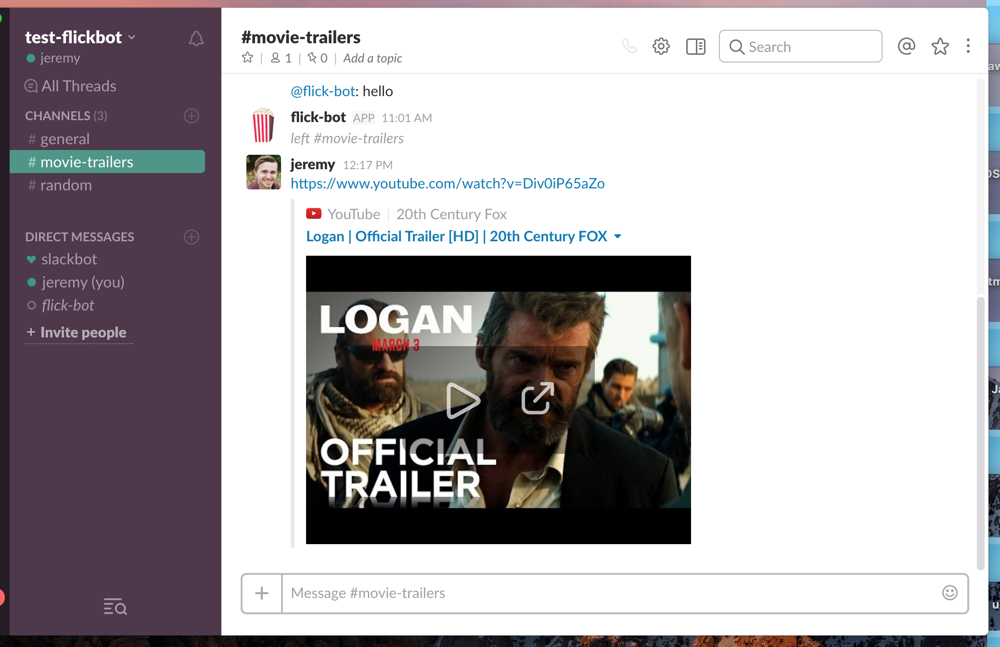

# Flickbot
 <i>Slack bot for Movie Trailers</i>

 

 

 APIs:

 * The Movie Database (themoviedb)
 * IMDbpy
 * YouTube Video

 Architecture:
  * [ 2 ] Amazon EC2 instances
  * [ 1 ] Apache Spark Cluster
  * [ 2 ] Amazon S3 buckets
  * [ 1 ] RDS Querying DB - Postgres
  * [ 1 ] SlackClient bot profile
  * [ 1 ] Slack Team for Testing

 

#### Phase I: The "Hello, World!" of Bot Trailers

>* Built data streaming pipeline from 3 APIs and the supportive cloud architecture
>* Deliver a single trailer to a Slack channel, given it is either from a `in theaters` or `coming soon` film

  

