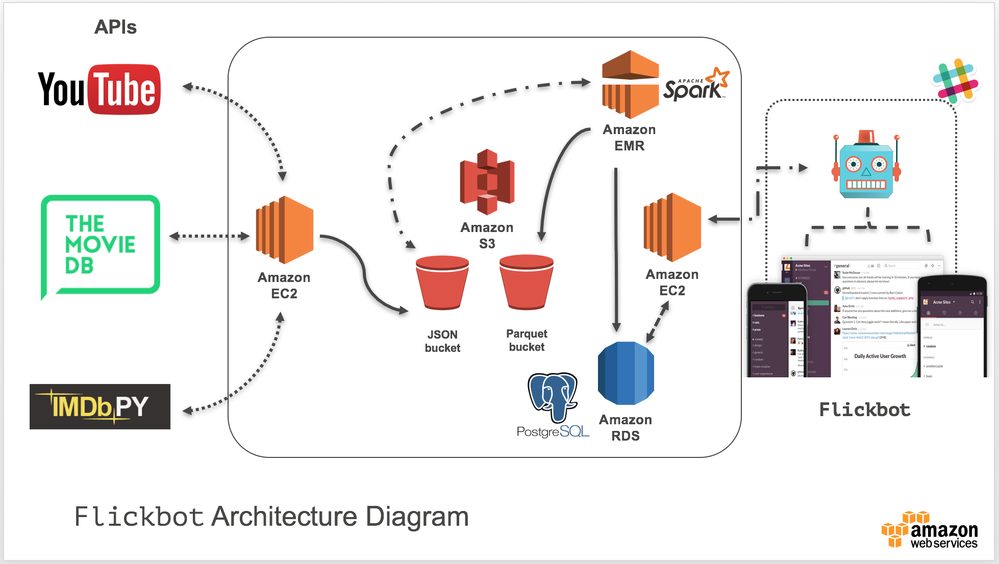

# Flickbot
 <i>Slack bot for Movie Trailers</i>

 

   
 

 

### Phase I: The "Hello, World!" of Bot Trailers

>* Built data streaming pipeline from 3 APIs and the supportive cloud architecture
>* Deliver a single trailer to a Slack channel, given it is either from a `in theaters` or `coming soon` film

 APIs Utilized:

 * [The Movie Database](https://www.themoviedb.org/documentation/api)
 * [IMDbpy](http://imdbpy.sourceforge.net/index.html)
 * [YouTube Video](https://developers.google.com/youtube/v3/)

### Phase II: Top 3 Trailers - <i>"Decision Tree" Filtering</i>

`Work In progress`

### Phase III: You Pick or Flickbot Picks - <i>Collaborative Filtering feature</i>

`Long-term goal`

 

 

 

   
 

 
---

[comment]: <> (>Below is a screenshot of how the YouTube trailer videos render in the Slack channel.)

[comment]: <> (

)
